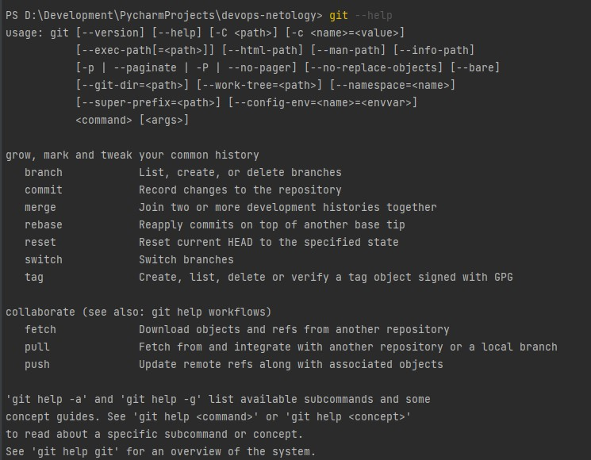

# Домашнее задание к занятию «2.1. Системы контроля версий.»

## Задание №1 – Создать и настроить репозиторий для дальнейшей работы на курсе.

Создайте репозиторий и первый коммит:

1. Зарегистрировал аккаунт https://github.com/Peretz-A013 
2. Создайте публичный репозиторий, который будете использовать дальше на протяжении всего курса, желательное название `devops-netology`.
   Обязательно поставьте галочку `Initialize this repository with a README`. 
    
3. Склонируйте репозиторий, используя https протокол (`git clone ...`) 
    
4. Перешёл в каталог (`cd devops-netology`)
5. Произвёл первоначальную настройку git, указав свое настоящее имя  и email (`git config --global user.name` и `git config --global user.email artem_nkz@mail.ru`).
6. Выполнил команду `git status` , результат `nothing to commit, working tree clean`.
7. Отредактировал файл `README.md` переведя файл в состояние `Modified`.
8. Еще раз выполнил `git status`. 
9. Проверил изменения в файле `README.md` выполнив команды `git diff` и `git diff --staged`.
10. Перевел файл в состояние `staged` командой `git add README.md`.
11. Погонял команды `git diff` и `git diff --staged`. 
12. Закоммитил `git commit -m 'First commit'`.
13. Сново посмотрел выводы команд `git status`, `git diff` и `git diff --staged`.

Создал файлы `.gitignore` и второй коммит:

1. Создал файл `.gitignore`. 
2. Добавил файл `.gitignore` в следующий коммит (`git add...`).
3. Создал каталог `terraform` и внутри этого каталога файл `.gitignore` по примеру: https://github.com/github/gitignore/blob/master/Terraform.gitignore.  
4. `.gitignore` в дальнейшем будет игнорировать все файлы в каталоге `.terraform`,
будет игнорировать все файлы c расширением `.tfstate` и их вариации, 
будет игнорировать все файлы c расширением `.tfvars`
будет игнорировать файлы с названием `crash.log`, `override.tf`, `override.tf.json`
так же будут игнорироваться файлы содержащие в названии любые символы перед `_override.tf`, `_override.tf.json`
и будут исключаться конфиг файлы `.terraformrc`, `terraform.rc`
5. Закоммител всё это с комментарием `Added gitignore`.

Экспериментируем с удалением и перемещением файлов (третий и четвертый коммит).

1. Создал файлы `will_be_deleted.txt` (с текстом `will_be_deleted`) и `will_be_moved.txt` (с текстом `will_be_moved`) и закоммител их с комментарием `Prepare to delete and move`.
1. Удалил файл `will_be_deleted.txt` с диска и из репозитория. 
1. Переименовал (переместил) файл `will_be_moved.txt` на диске и в репозитории, чтобы он стал называться `has_been_moved.txt`.
1. Закоммител результат работы с комментарием `Moved and deleted`.

Проверка изменений. 
1. В результате предыдущих шагов в репозитории есть коммиты:
    * `Initial Commit` – созданный гитхабом при инициализации репозитория. (Репозиторий был склонирован с вашего)
    * `First commit` – созданный после изменения файла `README.md`.
    * `Added gitignore` – после добавления `.gitignore`.
    * `Prepare to delete and move` – после добавления двух временных файлов.
    * `Moved and deleted` – после удаления и перемещения временных файлов. 
2. Проверьте это используя комманду `git log` (подробно о формате вывода этой команды мы поговорим на следующем занятии, 
но посмотреть что она отображает можно уже сейчас).

Отправка изменений в репозиторий. 
1. Выполните команду `git push`, если git запросит логин и пароль – введите ваш логин и пароль от github. 

В виде результата выполнения задания приложите ссылку на репозиторий. 

## Задание №2 – Знакомство с документаций

Один из основных навыков хорошего специалиста это уметь самостоятельно находить ответы на возникшие вопросы.
Чтобы начать знакомиться с документацией просто выполните в консоли команды `git --help`, `git add --help` и изучите их вывод.

При выполнении в консоле команды `git add --help` происходит редирект на локальную веб страницу с хелпом по команде.

